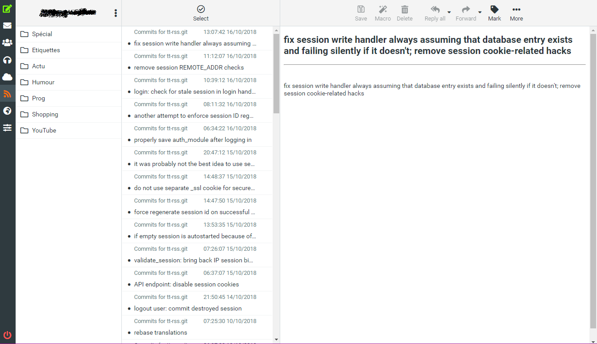
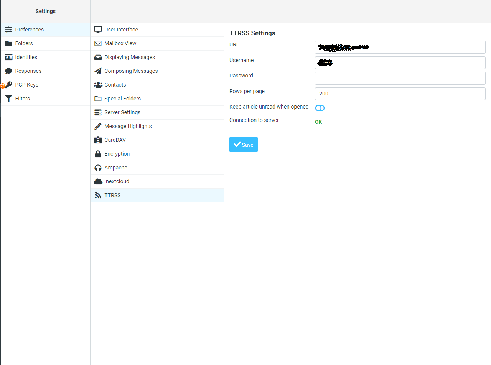

# TTRSS on RoundCube

Embed your TTRSS account into your RoundCube (used the TTRSS API)

**This plugin work only with RoundCube 1.4+ and with elastic skin**

# Installation

```
You need a fully functional TTRSS server
Install these content into your_roundcube_root/plugins/ttrss/
Configure your config.inc.php to add this plugin
Go to your settings into your RoundCube instance and add a server
```

# ToDo

```
Let the possibility to subscribe or unsubscribe to feeds
Find a way to count all article by feed (and activate button last page)
Make a folder list like the mail app for all nested category
Make loading indication for pending action
Optimization
```

# Bugs

```
Localization to improve and some texts was never changed from the Mail template
```

# Screenshots


